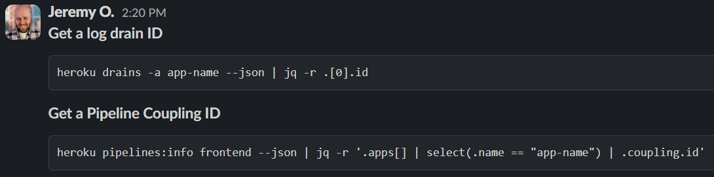

# Slackify Note

This plugin adds the following commands:
* `Slackify Note: Copy note as Slack Markdown` - Convert the note to Slack compliant markdown.
* `Slackify Note: Copy selection as Slack Markdown` - Convert the current selection to Slack compliant markdown.

[Install this plugin](https://obsidian.md/plugins?id=slackify-note)

## Examples

**Obsidian Selection**:

**Slack Message**:

